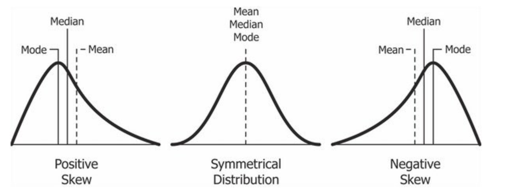
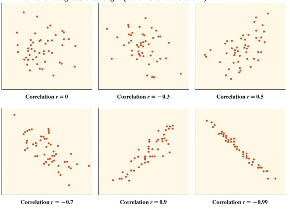

```{r setup, include=FALSE}
library(learnr)
library(tidyverse)
library(ggplot2)
library(mosaic)
library(palmerpenguins)
knitr::opts_chunk$set(echo = FALSE)
```

```{r load-data, context="data"}
elec_demo <- read.csv("./www/election_demographics.csv") %>% 
  mutate(stcounty_fips = str_pad(stcounty_fips, 5, "left", 0),
         DVP = (DEM/total_votes)*100,
         RVP = (REP/total_votes)*100)

ice_cream <- read.csv("./www/ice_cream_sales.csv")

```

## introduction

In this tutorial we're going to learn how to plot data with `ggplot2`. Plots are a good way to explore trends in the data.

Since it is part of the `tidyverse`, it has an intuitive structure it has three main parts:

-   A data set
-   A coordinate system
-   Geoms, which are visual marks that represent the data

Creating a GGPlot graph is a three part process:

-   Specifying data
    -   `ggplot(data = data_set_to_plot)`
-   Mapping aesthetics
    -   `ggplot(data = data_set_to_plot, aes(x = variable_to_plot))`
-   Adding a geometric layer
    -   `ggplot(data = data_set_to_plot, aes(x = variable_to_plot)) + geom_TYPE()`

A list of `geom_types` is available here [GGPlot Cheat Sheet](https://github.com/rstudio/cheatsheets/blob/main/data-visualization.pdf)

For this tutorial we're going to use the Palmer Penguins package, which we'll need to install before loading.

```{r penguins, echo=TRUE}

## install palmer penguins
## remember you only need to install packages once
install.packages("palmerpenguins")

## load palmer penguins library
library(palmerpenguins)
```

Let's take a look at the data using the `glimpse()` function. `glimpse()` is part of the `tidyverse()` package. It shows the columns horizontally, so you can see all of the columns at once.

Go ahead and try it below. Use the `glimpse()` function on the `penguins` data set.

```{r glimpse-palmer, exercise=TRUE}

```

```{r glimpse-palmer-hint}
glimpse(penguins)
```

The data has 344 rows and 8 columns including:

-   species
-   island
-   bill_length_mm
-   bill_depth_mm
-   flipper_length_mm
-   body_mass_g
-   sex
-   year

Now that we have an overview of our data, let's learn how to plot it.

## ggplot basics

The first step is to add a data layer. The first part is calling a `ggplot` object and passing the data to it.

```{r ggplot-data-layer, exercise=TRUE}

```

```{r ggplot-data-layer-hint}
ggplot(data = penguins)
```

This will create a basic, grey square. Next, we need to add an **aesthetic** layer. It is abbreviated **aes()**.

```{r ggplot-aes-layer, exercise=TRUE}

```

```{r ggplot-aes-layer-hint}
ggplot(data = penguins,
       aes(x = species))
```

In this example, we're going to add an x axis for species. Finally, we need to add a geometric layer.

In our example, we'll create a bar plot for different penguin species.

**NOTE:** The geometric layer is outside the parenthesis. We add it to the ggplot using an addition sign: `+`.

```{r ggplot-geom-layer, exercise=TRUE}

```

```{r ggplot-geom-layer-hint}
ggplot(data = penguins,
       aes(x = species)) +
  geom_bar()

```

## adding color

We can add color to our graph by adding `fill = variable_to_use` in the `aes` function. GGPlot will pick different colors based on the variable you use as the `fill` option.

Give it a try using the `species` variable!

```{r ggplot-color, exercise=TRUE}

```

```{r ggplot-color-hint}
ggplot(data = penguins,
       aes(x = species, fill = species)) +
  geom_bar()

```

GGPlot colors are very customizable. Some colors are more accessible than others. People with red-green color blindness may have a difficult time reading the bar chart we just made. You can find more colors [here](http://www.stat.columbia.edu/~tzheng/files/Rcolor.pdf).

### Adding secondary colors

We aren't limited to the same variables for the data and the fill. We can fill by other variables, too. All we have to do is change the `fill = variable_to_use` part of our ggplot call.

Give it a try by passing `island` to the `fill =` argument below. This will color the graph based on the island where the penguins are from.

```{r color-secondary, exercise=TRUE}

```

```{r color-secondary-hint}
ggplot(data = penguins,
       aes(x = species, fill = island)) +
  geom_bar()
```

## using standard measures

The chart we just made uses the total count of penguins by species and colors it by island. Sometimes our data isn't as easy to read as the `penguins` data set. For example, how many penguins of the Adelie species come from Biscoe? When the bars don't align directly with the numbers, it's difficult to read.

Let's standardize the y-axis (vertical) to show the percentage instead of count. Percents can range from 0 to 1 (0 to 100%) and are a bit more intuitive to read.

First, we'll add in our original ggplot that we made in the previous section:

```{r ggplot-original, exercise=TRUE}
ggplot(data = penguins,
       aes(x = species, fill = island)) +
  geom_bar()
```

We'll need to change a few things to get it to show the percentages rather than the counts.

First, we're going to use the tidyverse pipe `%>%` to chain together our arguments. We'll start by using `penguins %>%` to tell R that we want to use the `penguins` data set.

Second, we'll start our ggplot call on the next line. We need to add our ggplot layer by using `ggplot()`.

-   Inside the ggplot parenthesis, we'll specify the **aesthetics** using `aes()`. This will be exactly like before, where we'll use `species` for the x-axis (horizontal) and `island` for the the fill.

Third, we're going to add a new line called `ylab`, which stands for y-axis label. We're going to rename the y-axis to say `"Percent"`.

Finally, inside the `geom_bar()` call we're going to use the `position =` argument to change how the data is displayed. By setting `position = "fill"` we are telling ggplot to set the y-axis to range from 0-1 (or 0-100 percent).

Try and combine the pieces to make the new ggplot:

```{r ggplot-percent, exercise=TRUE}

```

```{r ggplot-percent-hint}
penguins %>% 
ggplot(aes(x = species, fill = island)) + 
        ylab("Percent") +
        geom_bar(position = "fill")
```

Our new plot shows the percentage of penguins in each species and location.

## quick lesson on distributions

Sometimes bar charts aren't helpful for visualizing data **density**. Density represents the distribution of a numerical variable. Essentially, we're looking at how spread out our data is.

In statistics, we often assume that data has a *normal distribution*. A normal distribution is symmetrical where the extreme values are equal distance from the median value, as in the middle graph below.

Data can also be skewed in a positive or negative direction.

In a positive skew (or right-skew), the most extreme values are positive and the tail of the curve is mostly in the positive.

In a negative skew (or left-skew), the most extreme values are negative and the tail of the curve is mostly negative.

{width="800"}

It's important to know how our data is distributed, because it affects the kinds of predictions we can make.

If our data is skewed to once side or another, we may have outliers which suggest that we may have to transform the data to make it normally distributed.

We can use histograms and density plots to test whether our data is skewed and whether it has a normal density.

## density plot

Two main plots for looking at data density are the box plot and violin plot.

### box plots

A box plot, also known as a box and whisker plot, shows us the five number summary for our data.

We can get these numbers by using the `summary()` function on a specific variable.

For example, let's get the five number summary for the penguins' bill length. In the box below use the `summary()` function on the `bill_length_mm` variable. Don't forget! to reference a specific variable you use the `$` operator.

```{r bill-length-summary, exercise = TRUE}

```

```{r bill-length-summary-hint}
summary(penguins$bill_length_mm)
```

We can see the numbers that indicate data distribution and density, plus how many NA values we have. NA stands for "Not Available" which means we are missing 2 values.

-   Min:
    -   This is the shortest bill length in our data set is 32.10 millimeters
-   1st Qu.:
    -   This is the first quartile. It shows that 25% of our data is less than 39.23
-   Median:
    -   The median value in our data is 44.45
    -   50% of our values are below 44.45 and 50% are above 44.45
-   Mean:
    -   The average bill length in our data is 43.92 mm
-   3rd Qu.:
    -   This is the third quartile. It shows that 75% of our data is less than 48.50 mm.
-   Max:
    -   The maximum bill length in our data is 59.60 mm

These numbers are good to have, but they're not very intuitive. It's difficult to picture whether this is distributed evenly.

### violin plots

Violin plots are good for visualizing the distribution of data for different groups. For example, we want to check the distribution of the data for our different species of penguins. It could be that one species of penguins has longer bills than other species.

We're going to create a box and whisker *and* violin plot at the same time. This will allow us to better see how the data is distributed.

Start with the same `penguins %>% ggplot(aes())` call that we used before.

Inside the `aes()` function, we're going to tell ggplot that we want to use `species` for the x-axis and `bill_length_mm` for the y-axis.

Then outside the parentheses, we're then going to add `+` a call to `geom_violin()`. Inside this call we want to color the violin plot by species by using the `aes(color = species)` argument.

Finally, we'll add `+` the boxplot by calling `geom_boxplot()`. We're going to specify that we want the width to be `0.3`. You can change this to any number you want, but `0.3` is the most visually appealing for this data. We're also going to use the same `aes(color = species)` argument in `geom_boxplot` that we did with `geom_violin()`

Give it a try below!

```{r box-violin, exercise=TRUE}

```

```{r box-violin-hint}
penguins %>% 
ggplot(aes(x = species,
           y = bill_length_mm))  +
  geom_violin(aes(color = species)) +
  geom_boxplot(width = .3, aes(fill = species))
```

### how to interpret the violin boxplot

Now that we've plotted the violin-boxplot, how do we interpret it?

Remember, the box plot visualizes the five number summary that we got using `summary(penguins$bill_length_mm)`

The thick black line in the middle of the box represents the *Median* for each species.

From our plot we can see that the Adelie penguin has a median bill length of about 38 mm. The Chinstrap penguin has a median bill length of about 50 mm. The Gentoo penguin has a median bill length of about 48 mm.

The third quartile range is the part of the box above the thick black line. The first quartile is the part of the box under the thick black line.

The wavy bits around the boxes is the violin plot. The violin plot shows us where most of the values in our data are located.

We can see from the Adelie violin plot that most Adelie penguins have a bill length close to the median value. For the Chinstrap penguin, the violin plot is more wavy. This indicates that the bill lengths of the Chinstrap penguin are mostly around 50 mm but there are quite a bit around 45 mm. The Gentoo penguin has bill lengths mostly around the median, but there are some extreme values as shown by the long tail of the plot on top.

## visualizing variable relationships

What happens if we want to visualizing the relationship between two or more variables? For example, let's say we wanted to know the relationship between a penguin's bill length and the depth of its bill (or height).

To visualize the relationship between **two numerical variables** we'll need to create a scatterplot. Scatterplots show the individual data points across an x and y axis.

To make a scatterplot, we'll need to change a few things in our ggplot call. It will start the same way: `penguins %>% ggplot(aes())`, but we'll need to specify both the x-axis and the y-axis in the `aes()` function. We're also going to switch to using `geom_point()` instead of `geom_box()`.

Give it a try below!

```{r scatterplot, exercise=TRUE}

```

```{r scatterplot-hint}
penguins %>% 
ggplot(aes(x = bill_depth_mm,
           y = bill_length_mm))  +
  geom_point()
```

### how to interpret scatterplots

Scatterplots are good at identifying patterns in the data, but how do we interpret the plot once we've made it?

Scatterplots can show whether there's a positive, negative, or no correlation between our two variables. In our scatterplot, there's a very weak positive correlation between bill length and bill depth. A weak positive correlation means that as bill depth increases, so does bill length. It's a weak relationship because the points are pretty scattered, but we can see that as bill depth increases bill lengths also increase.



- In the top left corner we can see a scatterplot with no correlation. The points appear to be random. 
- In the top middle, there is a weak negative correlation between the variables. This means that as the y-axis increases the x-axis decreases.
- In the top right, we see a weak positive correlation. This means that as the y-axis increases the x-axis increases too.
- In the bottom left, we see a strong negative correlation.
- In the bottom middle, is a strong positive correlation.
- Finally, in the bottom right is a near perfect negative correlation. 

### adding in a categorical variable

Categorical variables take on a limited number of values. For example, the month in which you were born is a categorical variable. It's only possible to have a birthday in one month. Type of penguin is also categorical variable because a penguin can only be of one type of penguin. 

Let's add a categorical variable to our graph by coloring the points by species of penguin. We'll do this by adding `color = species` to our `aes()` call.

```{r color-species, exercise=TRUE}

```
```{r color-species-hint}
ggplot(penguins,
       aes(x = bill_depth_mm,
           y = bill_length_mm,
           color = species)) +
  geom_point()
```


This looks great, but what if we wanted something other than dots? We can change the shape of the points by using the `shape = ` argument in the `aes()` call. We'll set the shape and color to species.

```{r color-shape, exercise=TRUE}

```
```{r color-shape-hint}
penguins %>% 
  ggplot(aes(x = bill_depth_mm,
             y = bill_length_mm,
             shape = species,
             color = species)) +
  geom_point()
```

## mosaic

What if we want to make it **very** easy? We're going to use a new package, **mosaic**. 

Mosaic gives us a point and click interface to make graphs using our data. 

First, we have to install it. If you're using the web browser, it's already been installed, and then we have to load the library.

```{r load-mosaic, eval=FALSE, include=TRUE}
install.packages("mosaic")

library(mosaic)

## we might have to install another package called manipulate
install.packages("manipulate")
```

We use mosaic by using `mPlot()` with the name of our data set in the parentheses. 

```{r mosaic-plot, exercise=TRUE}

```
```{r mosaic-plot-hint}
mPlot(penguins)
```


