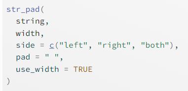

```{r setup, include=FALSE}
library(learnr)
library(tidyverse)
knitr::opts_chunk$set(echo = FALSE)

```

```{r loading-data, context = "data"}

elec_demo <- read.csv("./www/election_demographics.csv")

```

## Introduction

In this tutorial, we're going to do some basic statistics on a new data set. We'll start by loading the data, inspecting it, and then doing some basic plotting.

If you are following along online, the data is already loaded into the tutorial. If you are using R-Studio on your computer, be sure to change the `path` (the part in between the quotation marks `"`).

```{r load-data, echo=TRUE}
elec_demo <- read.csv("./www/election_demographics.csv")
```

### inspecting the data

We're going to get the column names, the total number of rows, and look at the first six rows. The three functions we'll use are `colnames()`, `nrow()`, `head()`. Inside the parenthesis, you'll include the dataset name, `elec_demo`.

```{r elec-demo-head, exercise=TRUE, exercise.eval=TRUE}

```

```{r elec-demo-head-hint}
colnames(elec_demo)
nrow(elec_demo)
head(elec_demo)
```

When we run `colnames()` we can see that our data has several columns:

| Column Name    | Description                                                                                        |
|------------------|------------------------------------------------------|
| stcounty_fips  | two digit state + three digit county FIPS                                                          |
| state_name     | state name                                                                                         |
| county_name    | county name                                                                                        |
| acs_year       | year that the demographic data comes from (2020)                                                   |
| med_age        | median age                                                                                         |
| total_pop      | total population                                                                                   |
| med_grossRent  | median gross rent                                                                                  |
| med_hhic       | median household income                                                                            |
| perc_white     | percent of the population that identifies as white                                                 |
| perc_black     | percent of the population that identifies as Black                                                 |
| perc_hispanic  | percent of the population that identifies as Hispanic                                              |
| perc_other     | percent of the population that identifies as Asian, Native Hawaiian and Pacific Islander, or other |
| edu_percentPop | percent of the population that holds an Associates degree or higher                                |
| election_year  | year that the election took place (2020)                                                           |
| DEM            | raw total of votes cast for the democratic nominee (Joe Biden)                                     |
| REP            | raw total of votes cast for the republican nominee (Donald Trump                                   |
| total_votes    | total number of votes cast for the two major parties                                               |

When we run `nrow(elec_demo)` it shows that our data set has 3,108 rows.

Finally, `head(elec_demo)` will show us the first six rows of our data set.

### cleaning the data

Notice the values in the `stcounty_fips` column. According to the table, `stcounty_fips`, is two-digit + three-digit fips, but in the `stcounty_fips` column, the first six values are only four digits. We will need to fix this column before we can do any analysis.

To clean the data, we'll use the `stringr` package. We can install it by running: `install.packages("stringr")`. The `stringr` package allows us to pad a value to a minimum width.

From the `stringr` package, we'll use `str_pad()`, which stands for string pad, to add a leading zero to our `stcounty_fips` column. This function takes several arguments:

-   the column we want to pad.
    -   for us, we'll use `elec_demo$stcounty_fips`
    -   the `$` is a selection operator in R that tells the computer that inside the `elec_demo` data set, we want to use the `stcounty_fips` column.
-   the width that we want our string to be
    -   the `stcounty_fips` column should be five digits
-   the side we want to add the padding to
    -   ours is the left
-   what we want to pad the string with
    -   `0`



To store the changes we need to add the variable name to the left hand side of the assignment operator `<-`

In the following box, use the `str_pad()` function to add the leading zeros to the `stcounty_fips` column.
```{r leading-zeros, exercise=TRUE}

```

```{r leading-zeros-hint}
elec_demo$stcounty_fips <- str_pad(elec_demo$stcounty_fips, 5, "left", 0)
```

```{r fix-fips}
elec_demo$stcounty_fips <- str_pad(elec_demo$stcounty_fips, 5, "left", 0)
```


We can check to make sure that our data is fixed by using `head()`. Instead of getting the top six rows, we can get the top 6 values in the `stcounty_fips` column by using the `$` operator.

In the box below, use `head()` and `$` to get the top six values for the `stcounty_fips` column

```{r top-values-stcounty, exercise=TRUE, exercise.setup="fix-fips"}

```

```{r top-values-stcounty-hint}
head(elec_demo$stcounty_fips)
```

The values now have five digits, perfect!

## Creating Columns

Our data set includes the raw vote count received by the democratic (`DEM`) and republican (`REP`) candidates in the 2020 election. We'll need to convert this to voting percentage before we can run a linear regression.

In this section, we'll create two new columns: `DVP` and `RVP` that will hold the Democratic and Republican Vote percentages for each county, respectively. 

The vote percentage is calculated by dividing the `DEM` and `REP` votes by `total_votes` and then multiplying by 100. 

$$ DVP = (DEM/total\_votes)*100 $$
$$ RVP = (REP/total\_votes)*100 $$

To create a column in R we use the `$` operator again, but this time instead of including a column name that is already in the data, we'll name it something new. Create two new columns called `DVP` and `RVP` and calculate the vote percentage for each party

```{r DVP-RVP, exercise=TRUE}

```

```{r DVP-RVP-hint}

## create the democratic vote percentage
elec_demo$DVP <- (elec_demo$DEM/elec_demo$total_votes)*100

## create the republican vote percentage
elec_demo$RVP <- (elec_demo$REP/elec_demo$total_votes)*100
```

```{r add-vp, exercise.setup="fix-fips"}
elec_demo <- elec_demo %>% 
  mutate(DVP = (DEM/total_votes)*100,
         RVP = (REP/total_votes)*100)
```

Let's look at the head of our data now

```{r head-vp, exercise=TRUE, exercise.setup="add-vp"}

```

We can see that in Autauga County, Alabama about 75% of the votes cast were for the Republican nominee!

## Linear Regression

Our data is now clean and we have our *dependent* variables (either `DVP` or `RVP`) we can run a linear regression using one of the *predictors* in our data. 

The variables we can use as predictors include:

- med_age
- total_pop
- med_grossRent
- med_hhic
- perc_white
- perc_black
- perc_hispanic
- perc_other
- edu_percentPop

In the example below,I use **med_hhic** as a predictor for Democratic Vote Percentage. The output is saved to a variable `lm_elec`, which we then use `summary` to get the coefficients.

```{r lm-dvp, exercise=TRUE, exercise.setup="add-vp"}

## run a linear regression
## DVP as the dependent variable
## med_hhic as the independent variable

lm_elec <- lm(DVP ~ med_hhic, data = elec_demo)

## get the summary
summary(lm_elec)
```

Use the box below to test out different linear regressions. The **dependent** variable can be either **DVP** or **RVP** and the **independent** variables are listed above.

Don't forget to run `summary()` to get the model's coefficients. 

```{r lm-practice, exercise=TRUE, exercise.setup="add-vp"}

```

## Adding in Controls

Controls are variables that are held constant throughout the experiment. In R, we can add controls by using `+ variable_name` after the original call. 

In the following code chunk, `med_hhic` is predicting `DVP` while holding `perc_white` constant. 

```{r lm-controls, exercise=TRUE, exercise.setup="add-vp"}

## linear regression with controls
## DVP is the dependent variable
## med_hhic is the independent variable
## perc_white is the control

lm_controls <- lm(DVP ~ med_hhic + perc_white, data = elec_demo)

## get the summary
summary(lm_controls)
```

We can add multiple control values by adding `+ variable_name` after `+ perc_white`.

In the box below, practice adding in controls. 

```{r lm-practice-controls, exercise=TRUE, exercise.setup="add-vp"}

```


